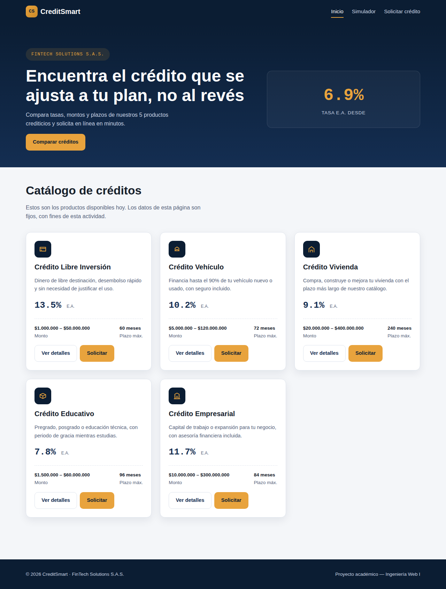
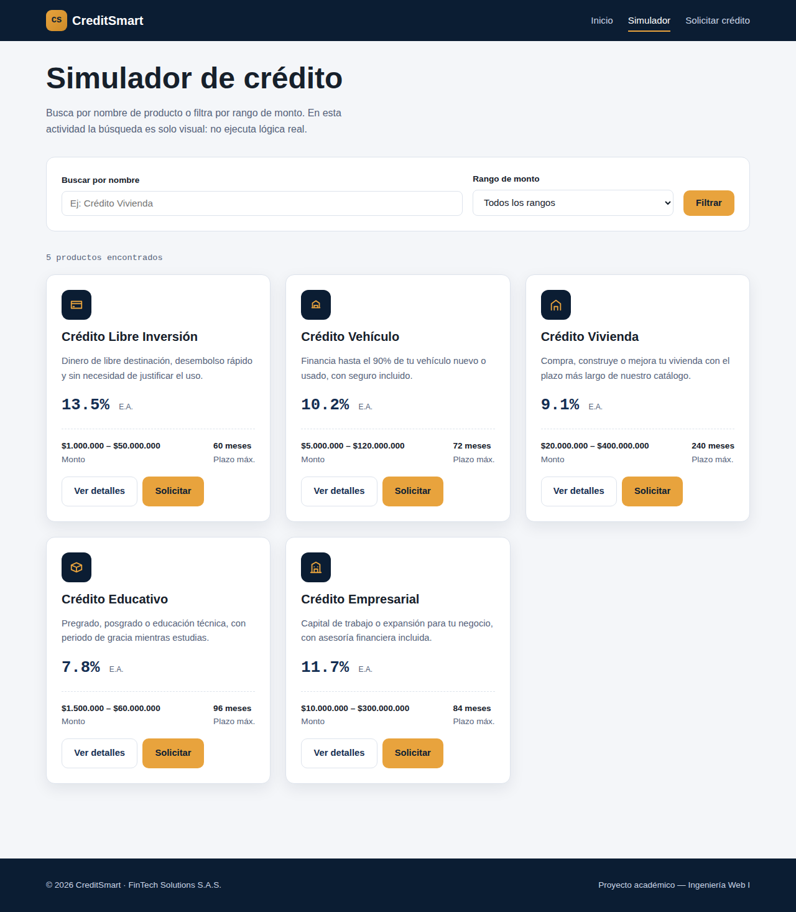
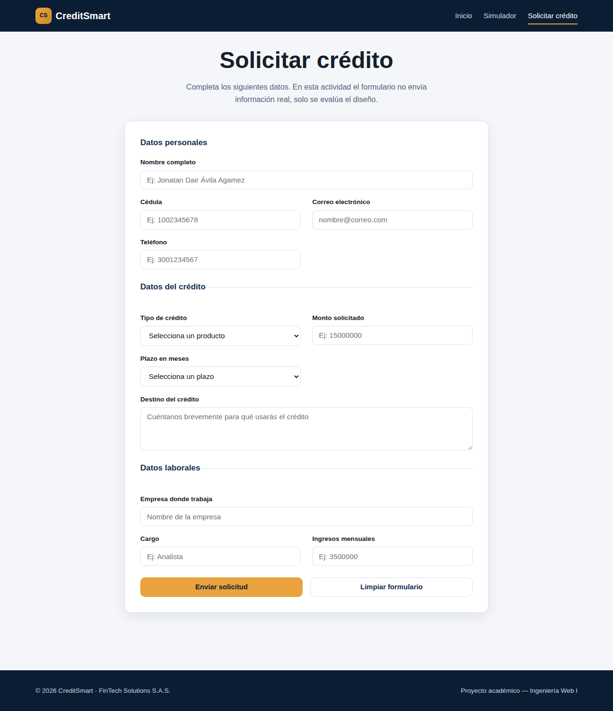
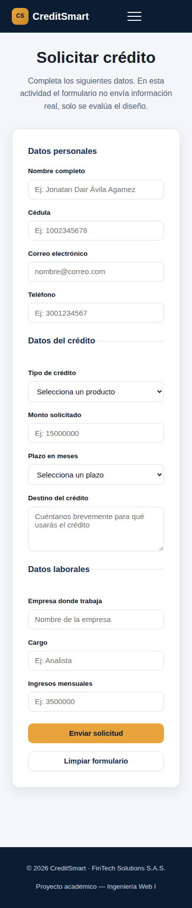

# CreditSmart — Diseño de Interfaces Web

**Estudiante:** Jonatan Dair Ávila Agamez
**GitHub:** [@jonathanagamez25](https://github.com/jonathanagamez25)
**Curso:** Ingeniería Web I — S20-EA1
**Institución:** Institución Universitaria Digital de Antioquia (IU Digital)

## Descripción del proyecto

Diseño de interfaz web para **CreditSmart**, la plataforma que FinTech Solutions S.A.S.
usaría para que sus usuarios consulten productos de crédito, simulen búsquedas por monto
y soliciten un crédito en línea. Es una actividad de **diseño** (HTML5 semántico + CSS3
responsive): los datos son fijos y los formularios no procesan información real, tal
como lo pide el enunciado de la evidencia de aprendizaje.

## Estructura de archivos

```
creditsmart/
├── index.html        # Página principal — catálogo de créditos
├── simulador.html     # Búsqueda y filtro (visual) de créditos
├── solicitar.html      # Formulario de solicitud de crédito
├── styles.css          # Hoja de estilos compartida por las 3 páginas
├── screenshots/        # Capturas de las 3 páginas (desktop y móvil)
└── README.md
```

## Cómo ejecutar el proyecto

No requiere instalación ni servidor. Basta con abrir `index.html` en cualquier
navegador (doble clic, o clic derecho → "Abrir con" → tu navegador). Desde ahí, el menú
de navegación lleva a las otras dos páginas.

## Decisiones de diseño

- **Paleta:** azul marino profundo (`#0B1D33`) para transmitir confianza financiera,
  combinado con ámbar (`#E8A33D`) como color de acción — botones, tasas destacadas.
- **Tipografía:** *Space Grotesk* para títulos, *Inter* para texto de lectura, e *IBM
  Plex Mono* para las cifras de tasas — le da a los números un aire de "ticker
  financiero" que refuerza el tema del sitio.
- **Grid responsive sin media queries:** el catálogo de créditos usa
  `grid-template-columns: repeat(auto-fit, minmax(280px, 1fr))`, así que el navegador
  decide cuántas tarjetas caben por fila según el ancho disponible, sin fijar "3
  columnas" a mano.
- **Menú móvil sin JavaScript:** se usa el truco del *checkbox oculto* (`#nav-toggle`)
  para abrir/cerrar el menú en pantallas pequeñas con solo CSS.
- **Accesibilidad:** foco visible en todos los elementos interactivos, `fieldset` +
  `legend` para agrupar el formulario, `aria-current="page"` en el enlace activo del
  menú, y un *skip link* al contenido principal.

## Capturas de pantalla

### Página principal (Inicio)
Desktop:


Móvil:


### Simulador de crédito


### Solicitar crédito
Desktop:


Móvil:


## Nota sobre el uso de asistencia de IA

Se usó asistencia de IA (Claude) para generar la estructura inicial de HTML/CSS de este
proyecto, declarado aquí conforme a la política del curso. El código fue revisado y
puede explicarse en detalle en la sustentación: cada decisión (paleta, tipografía, por
qué el grid es responsive sin media queries, por qué el menú móvil funciona sin
JavaScript) está documentada en comentarios dentro de `styles.css` y de cada archivo
HTML.
